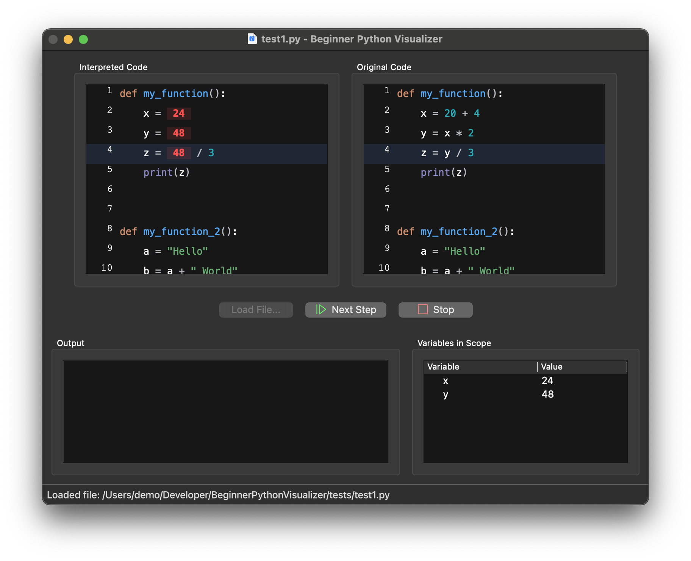

# Beginner Python Visualizer




## Description

Beginner Python Visualizer is a PyQt application that helps beginners understand how code works step-by-step in Python. Essentially a 'lightweight' debugger, it provides a visual representation of how variables change values, making it easier to grasp the flow and logic of the program.

## Features

- Step-by-step code execution visualization
- Support for running individual Python script files
- Built with Pyside 6.6.1 (PyQt6)

## Installation

1. Clone the repository:

   ```bash
   git clone https://github.com/jschoeny/BeginnerPythonVisualizer.git
   ```
2. Install the required packages:

   ```bash
   pip install -r requirements.txt
   ```
3. Run the application:

   ```bash
   python mainwindow.py
   ```

## Usage

1. Press the `Load File...` button to load a Python script file.
2. Press the `Run Code` button to start the script.
3. Press the `Next Step` button to execute the next line of code.
4. Press the `Stop` button to stop the execution of the script.

### Command Line Arguments

The following command line arguments are also supported:

- `-h`, `--help`: Show the help message and exit.
- `-f`, `--file`: The path to the Python script file to be loaded on startup.
- `-d`, `--debug`: Enable debug logging.

## Tests

To run the tests, run the following command:

```bash
python -m unittest discover
```

`test_steplogger.py` is used to test the `StepLogger` class. The Python scripts to be used for testing are located in the `test_programs` directory.
